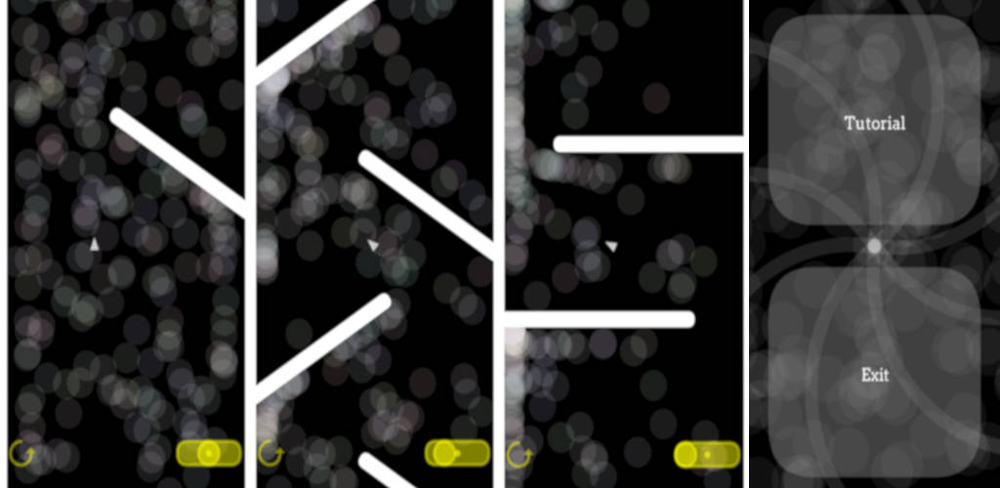

# Lost Leaf
A Casual Android game

### https://play.google.com/store/apps/details?id=pt.softlab.lostleaf (Beta)

### Level editor and Viewer at https://github.com/linux-man/lostleaf/releases

The concept is to guide a “leaf” through obstacles by tilting and creating objects.

I figured that this kind of game should have well designed levels, so I wrote a Level Editor and a Java version to test the levels.

